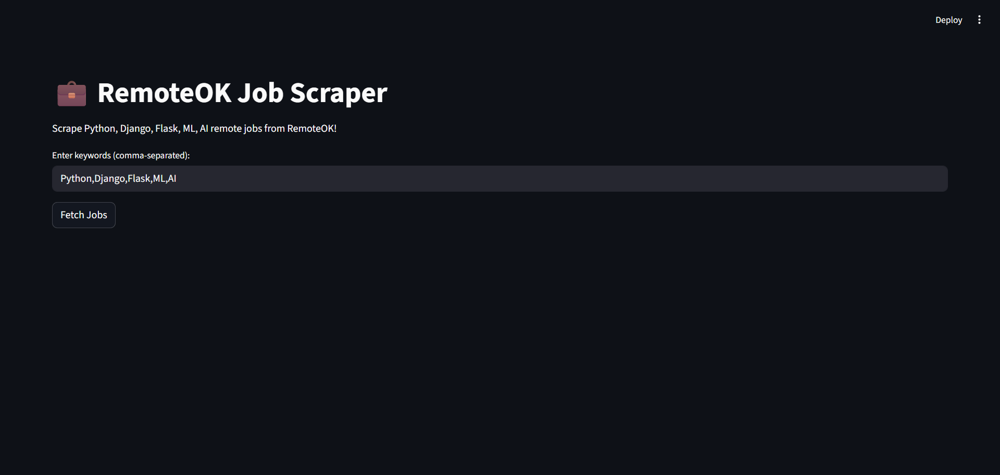
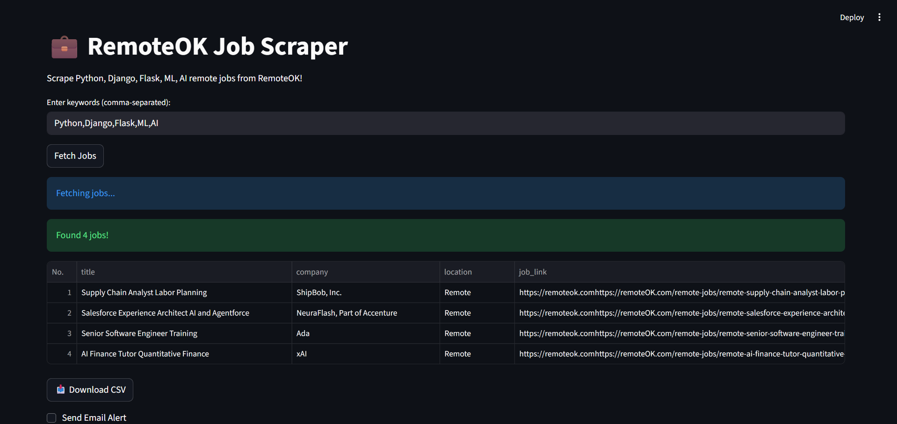
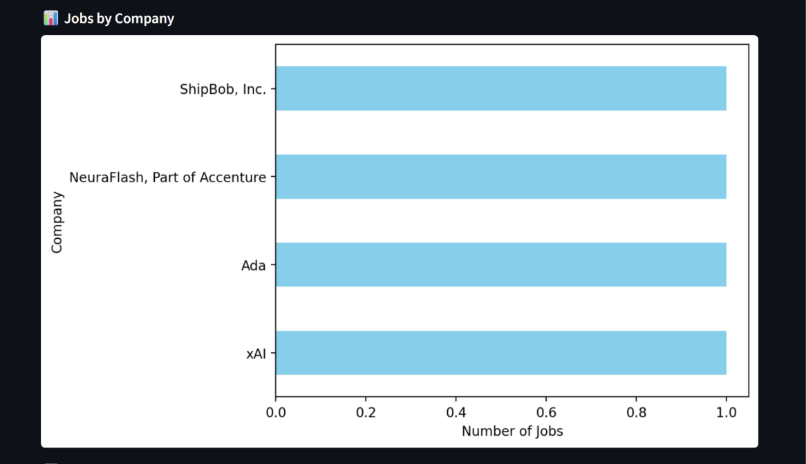
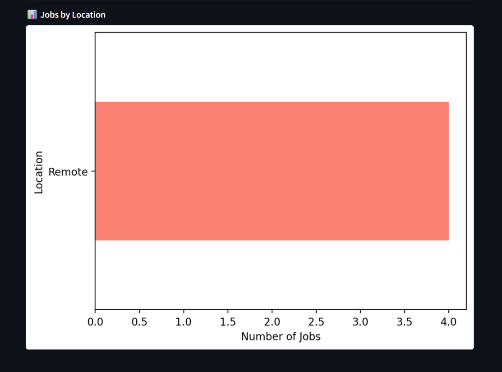

# 💼 RemoteOK Python Job Scraper

This project **automates the collection of remote Python, Django, Flask, ML, and AI jobs** from [RemoteOK](https://remoteok.com) and presents them in a **clean, interactive Streamlit dashboard**. Users can view job details, download results as CSV, visualize top companies and locations, and optionally receive email alerts.  

Built with **Python**, **Pandas**, **Requests**, and **Streamlit**, this project demonstrates **backend workflows, data scraping, data handling, and interactive dashboard creation**, making it ideal for showcasing Python backend and automation skills.

## Project Goals

- Automatically fetch remote jobs by **scraping RemoteOK website HTML**  
- Process, filter, and store job data in CSV (simulating database operations)  
- Build an interactive dashboard to visualize jobs by company and location  
- Demonstrate backend development skills with data workflows and optional email alerts  
- Showcase Python, data handling, and dashboard development for portfolio/mentorship

## Tools & Technologies

- Python  
- Pandas & NumPy  
- Requests (REST API fetching)  
- Streamlit (interactive dashboard)  
- Matplotlib (visualizations)  
- SMTP (optional email alerts)  

## Project Structure

remoteok-job-scraper/  
│  
├── final_streamlit_app.py  # Streamlit app with dashboard and optional email alerts  
├── requirements.txt        # Python libraries  
├── README.md               # Project documentation  
├── jobs_YYYY-MM-DD.csv     # Sample CSV outputs of fetched jobs  
└── screenshots/            # Screenshots of dashboard and visualizations  

## Features

1. **Automated Job Scraper**  
   - Fetches job data via RemoteOK REST API  
   - Filters jobs based on keywords (Python, Django, Flask, ML, AI)  
   - Handles missing data (location defaults to "Remote")  
   - Saves jobs in versioned CSV files  

2. **Interactive Dashboard**  
   - Displays jobs in a **numbered table**  
   - Visualizes **top companies** by number of jobs  
   - Visualizes **top locations** by number of jobs  
   - Supports CSV download  

3. **Optional Email Alerts**  
   - Sends job summaries via email to a specified recipient  
   - Demonstrates **backend workflow and automation skills**  

## Screenshots

### Dashboard Page


### Jobs Table


### Top Companies Graph


### Top Locations Graph


## How to Run the App

### 1. Clone the repository
```bash
git clone <your-repo-url>
cd <repo-folder>
```

### 2. Install dependencies
pip install -r requirements.txt

### 3. Run Streamlit
streamlit run streamlit_app.py

### 4. Explore the app
- Enter keywords (comma-separated, e.g., Python, Django, Flask, ML, AI)
- Click Fetch Jobs to see jobs in a table and graphs
- Download CSV of job listings
- Optionally enable Send Email Alert to test email functionality

## Deployment
This app can be deployed online for free using Streamlit Cloud:

- Connect GitHub repository
- Set streamlit_app.py as the main file
- Deploy → the app will be live online for anyone to access

## Learnings
- Fetching and processing data from a REST API
- Handling missing data and storing results in CSV (simulating database operations)
- Building interactive dashboards with Streamlit
- Visualizing job trends using Matplotlib
- Implementing optional backend automation with email alerts

## Key Insights from Dashboard
- Remote Python/ML/AI jobs are concentrated among a few top companies
- Most jobs are listed as Remote
- Interactive visualizations make it easier to track companies and locations posting jobs